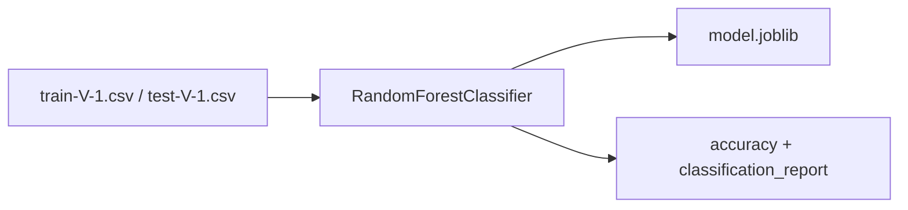
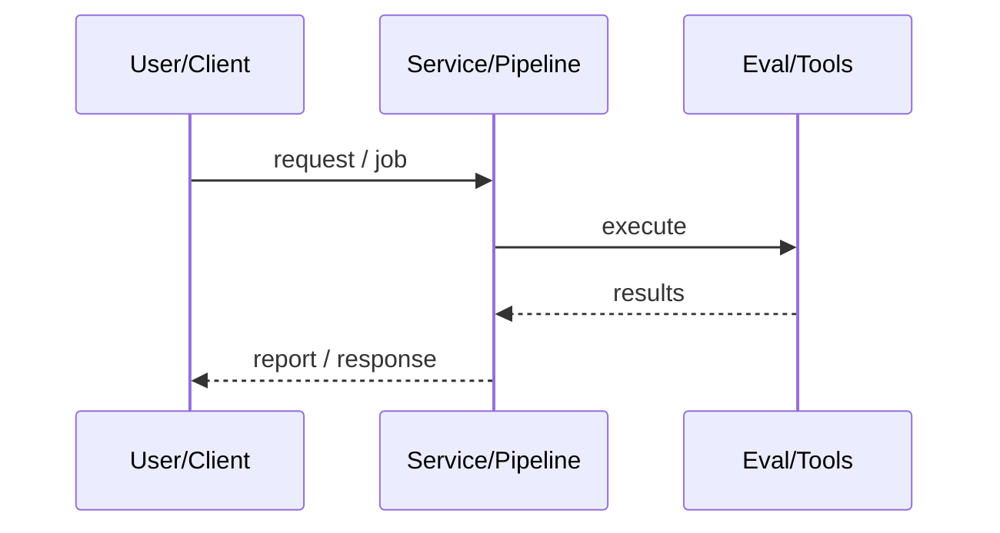
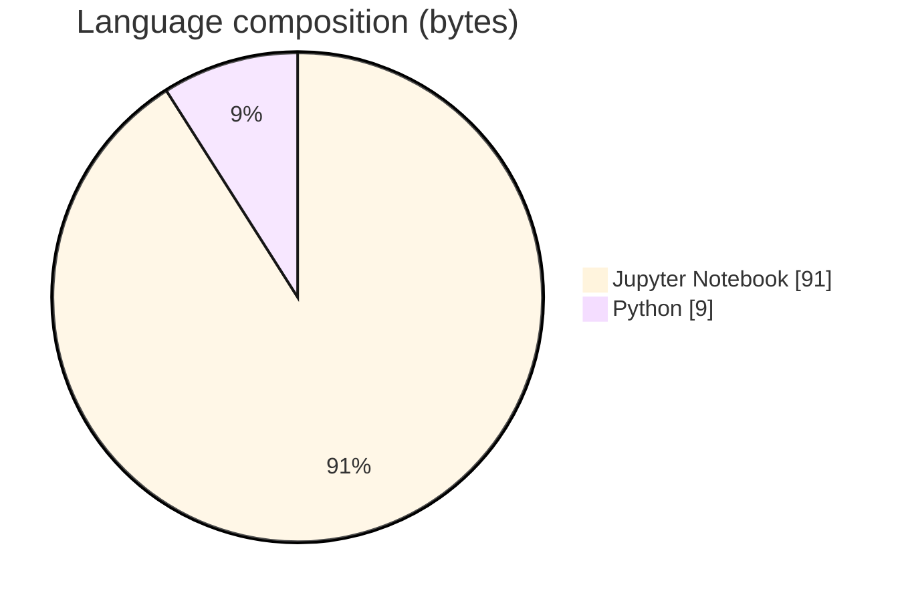

# Mobile Price Range Classification

### RandomForest mobile price-band classifier with SageMaker-style training script.

[](https://github.com/ArchanaChetan07/Mobile_Price_classification)
[](https://github.com/ArchanaChetan07/Mobile_Price_classification)
[](https://github.com/ArchanaChetan07/Mobile_Price_classification)
[](https://github.com/ArchanaChetan07/Mobile_Price_classification/actions)

---

## Overview

Classify phones into price ranges from tabular hardware/feature CSVs.

research.ipynb for exploration; script.py trains sklearn RandomForestClassifier with argparse hyperparameters and SageMaker channel env vars (SM_MODEL_DIR, SM_CHANNEL_*), saves model.joblib, prints test accuracy/report at runtime.

Train/serve-oriented classification script plus train/test CSV splits.

This repository is maintained as **production-minded portfolio work**: clear architecture, automated checks where present, and metrics that are **traceable to committed artifacts** (never invented).

---

## Architecture

CSV train/test → RandomForestClassifier.fit → model.joblib → predict + accuracy_score/classification_report on test set.





---

## Results & repository facts

> Only values found in code, configs, tests, or generated reports are listed. Absence of a clinical/ML accuracy number means it was **not** published in-repo.

| Metric | Value | Source |
|---|---|---|
| Tracked repository files | **9** | `git tree` |
| Default n_estimators | **100** | `script.py` |
| Documented train/test split labels in logs | **85% / 15%** | `script.py print statements` |
| Tracked files | **9** | `git tree` |
| Python modules | **2** | `git tree` |
| Test-related paths | **1** | `git tree` |
| CI workflows | **Yes** | `.github/workflows` |
| Docker present | **No** | `repo root` |



---

## Key features

- Hyperparameters: n_estimators (default 100), random_state
- Train/test CSV channels
- Joblib model export
- research notebook

---

## Tech stack

| Layer | Technology |
|---|---|
| ml | scikit-learn RandomForestClassifier |
| data | pandas |
| serialization | joblib |
| cloud | AWS SageMaker-style training script |
| ci | GitHub Actions |

---

## Skills demonstrated

Jupyter Notebook · s · c · i · k · t · CI/CD · testing · automation

Keyword surface: **Python · Jupyter Notebook · machine-learning · CI/CD · testing · API · Docker · automation · data-science · software-engineering · system-design · observability · LLM · cloud**

---

## Project structure

```text
Mobile_Price_classification/
├── script.py
├── research.ipynb
├── train-V-1.csv / test-V-1.csv / mob_price_classification_train.csv
├── requirements.txt
├── tests/
└── .github/workflows/ci.yml
```

---

## Installation & usage

```bash
git clone https://github.com/ArchanaChetan07/Mobile_Price_classification.git
cd Mobile_Price_classification
pip install -r requirements.txt
python script.py --train . --test . --model-dir .
```

---

## How it works

script.py reads train/test CSVs, pops the last column as label, fits RandomForest, dumps model.joblib, and prints test metrics. No committed accuracy value in repo files was found.

---

## Future improvements

- Persist metrics.json from a training run
- Clarify SageMaker vs local run instructions

---

## License

See repository.

---

<p align="center">
  <b>Mobile Price Range Classification</b><br/>
  <a href="https://github.com/ArchanaChetan07/Mobile_Price_classification">github.com/ArchanaChetan07/Mobile_Price_classification</a>
</p>
